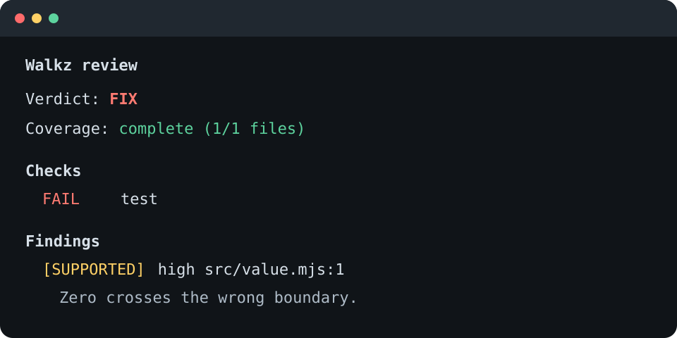
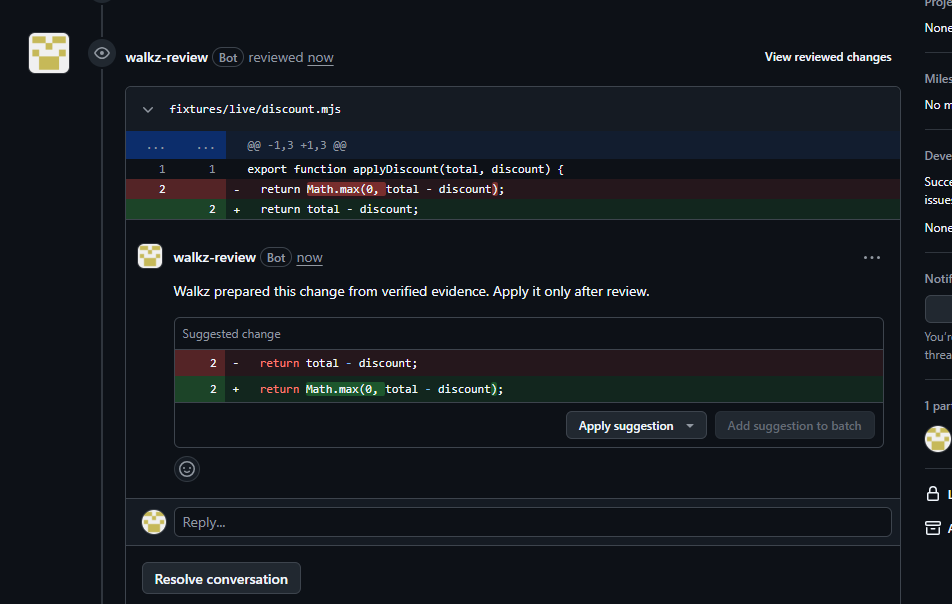

# Walkz

**AI-powered pull request co-pilot.**

Walkz reviews diffs, runs repository checks, and uses evidence instead of
model confidence to decide whether a change is ready to ship.

The rule is simple: models choose what to investigate; evidence decides what to
trust. A finding becomes blocking only when the same reproducer passes on the
base commit and fails on the pull-request head.



## Try the local demo

You need Node.js 24 or newer, npm 11, and Git.

```powershell
npm ci
npm run demo
```

The demo builds a disposable Git repository, introduces a boundary regression,
and returns `FIX` only after a failed check points to the changed line. It uses
the built-in mock provider, so it needs no API key or network access.

## Use Walkz locally

The local CLI is the quickest path today. A normal review looks like this:

1. Create or check out a branch in the repository you want to review.
2. Initialize Walkz once and let it inspect the repository commands.
3. Run `doctor` to catch missing Git, Node, configuration, or provider setup.
4. Run `review` before opening a pull request, or use `--staged` for work that is not committed yet.
5. Read the checks, changed-line findings, coverage notes, and final verdict.
6. Fix the branch, run the review again, and open the pull request when the result is ready.

Walkz is currently run from source. This example assumes the Walkz checkout and
the target repository share a parent directory:

```powershell
npm ci
npm run build
cd ..\target-repository
node ..\Walkz\apps\cli\dist\bin.js init
$env:GROQ_API_KEY = "your-key"
node ..\Walkz\apps\cli\dist\bin.js doctor
node ..\Walkz\apps\cli\dist\bin.js review
```

`review` compares the current branch with its merge base. Use `--staged` for
staged changes, `--no-model` for deterministic checks only, or `--json` for
machine-readable output.

Useful command examples:

```powershell
# Review committed changes against the merge base
node ..\Walkz\apps\cli\dist\bin.js review

# Review only what is staged
node ..\Walkz\apps\cli\dist\bin.js review --staged

# Run repository checks without a model call
node ..\Walkz\apps\cli\dist\bin.js review --no-model

# Save a machine-readable result for CI or another tool
node ..\Walkz\apps\cli\dist\bin.js review --json
```

The process exits with `0` for `SHIP`, `1` for `FIX`, `2` for `HUMAN` or
`INCONCLUSIVE`, and `3` for configuration or infrastructure errors. A `FIX`
result means the configured evidence policy found something that needs attention;
it does not apply a patch automatically.

## Use the GitHub App

The hosted app currently runs from the local Docker stack described below. A
normal review looks like this:

1. Sign in with GitHub and install Walkz on the repository you want to review.
2. Select that repository in the dashboard and connect a Groq API key for it.
3. Open a pull request, then enter its number under **Run a review**.
4. Walkz records the exact base and head commits and creates a pending `Walkz / review` check.
5. Watch the run in **Recent reviews**. The page updates as the review moves through checks, model review, and evidence collection.
6. Open the GitHub check to see the verdict, evidence level, commit pair, and any incomplete coverage.
7. When a verified finding has a proposed replacement, inspect the exact text in the dashboard and approve or reject it.
8. After approval, Walkz re-runs the proof and regression checks. It publishes a GitHub suggestion only when those checks pass against the same pull-request head.

Comment commands such as `@walkz review` are not implemented. Start a manual
review from the dashboard, or configure reviews for ready-for-review and push
events.

Walkz never merges the pull request or applies a patch on its own. An approved
replacement is re-proved first, then published as a GitHub suggestion for the
developer to apply.

Walkz reads command authority from the trusted base revision, runs approved
commands without a shell, validates findings against changed lines, and reports
incomplete coverage. Provider-backed review sends bounded context to Groq only
after the repository checks run.

### Approved fix on GitHub

After approval and successful reproof, Walkz publishes the exact replacement as
a native GitHub suggestion. The developer still decides whether to apply it.



## What is implemented

- Local CLI review with deterministic checks, mock and Groq providers, changed-line validation, and `SHIP`, `FIX`, `HUMAN`, `INCONCLUSIVE`, and `ERROR` verdicts.
- Counterfactual proof that runs a bounded reproducer against exact base and head revisions.
- Hosted PostgreSQL state, Redis and BullMQ workers, transactional outbox delivery, leases, restart recovery, encrypted provider credentials, audit retention, cancellation, and stale-run supersession.
- GitHub App support with signed OAuth sessions, selected-repository discovery,
  verified webhooks, explicit review triggers, exact-SHA checks, repository
  configuration, review history, and finding details.
- Bounded fix proposals with explicit approval, isolated reproof and regression
  checks, and apply-ready GitHub suggestions tied to the reviewed head commit.

The hosted stack runs locally, but it is not a production deployment. A real
pull request has completed the review, approval, reproof, and GitHub suggestion
path. Fix branches, automatic patch application, and automatic merges are not
implemented.

## Run the hosted stack locally

The hosted services run together with Docker Desktop. PostgreSQL and Redis stay
inside the Compose network. The dashboard listens on port 3000, while port 3001
exposes the API readiness check on localhost.

First expose dashboard port 3000 through a public HTTPS tunnel. Copy its origin,
without a trailing slash, into this command:

```powershell
npm run hosted:init -- --public-url https://your-public-origin
```

The setup command generates the local secrets and refuses to replace an existing
`infra/.env` file. Keep that file on your machine.

Register a GitHub App with these settings:

- Set the callback URL to `https://your-public-origin/auth/github/callback`.
- Enable webhooks and use `https://your-public-origin/webhooks/github`.
- Copy `GITHUB_WEBHOOK_SECRET` from `infra/.env` into the webhook secret field.
- Request metadata read, contents read, issues read, pull requests read, and
  checks read/write. Leave every other permission off.
- Subscribe only to the pull request event and keep SSL verification enabled.
- Leave wildcard callbacks, OAuth during installation, Device Flow, the setup
  URL, and the IP allow list disabled or blank.
- Limit installation to your account. During installation, select only the
  repositories that Walkz should review.

After creating the App, copy its App ID and Client ID into `infra/.env`, then
generate a client secret. The client secret is a text value. The private key is
a separate `.pem` download; store it outside the repository and put its Base64
content in `GITHUB_PRIVATE_KEY_BASE64`.

Start the stack after all placeholders in `infra/.env` have been replaced:

```powershell
docker compose --env-file infra/.env -f infra/compose.yml up -d --build
```

Open the public HTTPS origin and sign in with GitHub after the health checks pass.
The local dashboard is at `http://localhost:3000`, and the API readiness endpoint
is `http://localhost:3001/health/ready`.

The public address must reach the dashboard rather than the API port. The
dashboard forwards the allowlisted OAuth, webhook, and API routes to the private
API service. If a temporary tunnel address changes, update the two GitHub App
URLs and `GITHUB_OAUTH_CALLBACK_URL` in `infra/.env`.

The dashboard asks the signed-in user to choose an installed repository and
connect a Groq key. Enter an open pull request number under **Run a review**;
**Recent reviews** updates while the GitHub check runs. Verified findings can
show a bounded replacement for approval. Successful reproof publishes that
replacement as a GitHub suggestion.

## Verify the project

```powershell
npm run verify
```

Score a bounded, metadata-only review snapshot by exact configuration, provider,
model, and prompt version:

```powershell
npm run evaluate:reviews -- --input tests/golden/review-evaluation-snapshot.json
```

The report uses labeled findings to measure false positives and proof attempts
to measure proof rate. It does not claim recall from production feedback because
that data cannot reveal defects Walkz never reported.

## Roadmap

Milestones 1 through 5 are complete. The current hosted path covers the GitHub
App, check publishing, configuration, review history, bounded fix proposals,
human approval, reproof, and GitHub suggestions. Milestone 6 remains planned and
adds deeper reliability, specialist review passes, evaluation, and more
languages.
